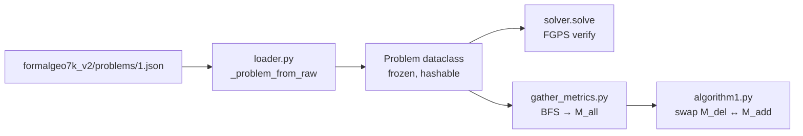

# 01 — Formal Language (CDL)

> **Read this first if you've never touched a formal-math language.** This page
> is the 10-minute on-ramp for an MLLM researcher who wants to understand what
> a *Conditional Declaration Language* (CDL) statement is, why FormalGeo uses
> one, and how it shows up in our Python types.
>
> **The metaphor to hold in your head:** *FormalGeo is to geometry what a typed
> AST is to a programming language.* The natural-language problem statement is
> the source code; the CDL is the parsed, type-checked AST; the symbolic
> solver (FGPS) is the interpreter that evaluates it.

## Why a formal language at all?

A textbook geometry problem says

> *"As shown in the diagram, triangle RST is congruent to triangle XYZ, TR=x+21,
> ZX=2x−14, ∠TRS=4y−10°, ∠ZXY=3y+5°. Find the value of y."*

A language model can answer this *most* of the time, but it has no way to
**verify** its own answer — there is no `assert` in English. CDL fixes that by
re-expressing every clause as a typed predicate over named geometric entities.
Once a problem is in CDL, a symbolic engine (FGPS) can search a 196-theorem
library and either return a verified answer or report failure. Algorithm 1
(Phase 2) needs that verification step to label synthetic problems —
hallucinated answers would silently poison the training set.

## The four CDL blocks

FormalGeo splits every problem into four parallel CDL blocks plus a single
goal. Each block answers a different question:

| Block               | Answers                                            | Held fixed by Algorithm 1? |
|---------------------|----------------------------------------------------|----------------------------|
| `construction_cdl`  | How is the figure built? (points, lines, shapes)  | **Yes** — never swapped    |
| `text_cdl`          | What does the *problem text* tell you?             | No — part of `M_p`         |
| `image_cdl`         | What can only be read *from the diagram*?          | No — part of `M_p`         |
| `goal_cdl`          | What single quantity must the solver find?         | Re-picked per synthetic    |

Algorithm 1 (Phase 2) defines `M_p = text_cdl ∪ image_cdl`. That's the set of
*metric conditions* eligible for the random swap. Construction is held fixed
because changing it would change the figure itself, not just the problem.

The text/image split matters: re-routing a condition from `text_cdl` to
`image_cdl` *forces the model to read the diagram*. See
[02 — Condition Sampling](./02-Condition-Sampling) for why this is the headline
data-side ablation.

## Worked example — PID=1, side by side

This is the first problem in FormalGeo7K v2
(`data/formalgeo7k_v2/problems/1.json`), with its rendered diagram in
`data/formalgeo7k_v2/diagrams/1.png`.

| Layer        | Content                                                            |
|--------------|--------------------------------------------------------------------|
| **NL (en)**  | "Triangle RST is congruent to triangle XYZ, TR=x+21, ZX=2x−14, ∠TRS=4y−10°, ∠ZXY=3y+5°. Find the value of y." |
| **NL (cn)**  | "如图所示，三角形RST与三角形XYZ是全等三角形，TR=x+21，ZX=2*x-14，∠TRS=4*y-10°，∠ZXY=3*y+5°。求y的值。" |
| `construction_cdl` | `Shape(RS,ST,TR)`<br>`Shape(XY,YZ,ZX)`                       |
| `text_cdl`         | `CongruentBetweenTriangle(RST,XYZ)`<br>`Equal(LengthOfLine(TR),x+21)`<br>`Equal(LengthOfLine(ZX),2*x-14)`<br>`Equal(MeasureOfAngle(TRS),4*y-10)`<br>`Equal(MeasureOfAngle(ZXY),3*y+5)` |
| `image_cdl`        | `Equal(LengthOfLine(TR),x+21)`<br>`Equal(LengthOfLine(ZX),2*x-14)`<br>`Equal(MeasureOfAngle(TRS),4*y-10)`<br>`Equal(MeasureOfAngle(ZXY),3*y+5)` |
| `goal_cdl`         | `Value(y)`                                                   |
| `problem_answer`   | `15`                                                         |
| `theorem_seqs`     | `congruent_triangle_property_angle_equal(1,RST,XYZ)`         |

Read the table top-to-bottom and watch the abstraction climb: the NL sentence
becomes typed predicates, the predicates become a goal, the solver returns a
single theorem application that closes the proof, and the engine certifies
`y = 15`.

A few details worth lingering on:
- **`Shape(RS,ST,TR)`** is *construction* — a triangle is defined by its three
  ordered sides. Two `Shape(...)` statements give you both triangles.
- **`CongruentBetweenTriangle(RST,XYZ)`** is a *relation*. The order matters:
  R↔X, S↔Y, T↔Z (so ∠TRS ↔ ∠ZXY).
- **`Equal(MeasureOfAngle(TRS),4*y-10)`** wraps an *attribution*
  (`MeasureOfAngle(TRS)`, in degrees) inside an `Equal(...)` to make it a
  metric condition. Attributions never appear bare in `text_cdl` /
  `image_cdl` — they always live inside `Equal(...)`.
- **`image_cdl` ⊆ `text_cdl` here** — that's not an error: when the textbook
  also draws the values on the diagram, the same condition lives in both
  blocks. Algorithm 1 will eventually shuffle these around.
- **`Value(y)`** is the *symbolic* goal — find the numeric value of the algebra
  variable `y`. Other goal kinds you'll meet later: `Value(LengthOfLine(AC))`,
  `Relation(Parallel(AB,CD))`, `Logic(...)` for boolean facts.

## The 88 predicates and 196 theorems at a glance

FormalGeo7K v2 ships its **predicate** library in
`data/formalgeo7k_v2/gdl/predicate_GDL.json` and its **theorem** library in
`data/formalgeo7k_v2/gdl/theorem_GDL.json`. Both are loaded automatically by
the `formalgeo` PyPI package; `open_geofm.formal.solver._searcher` caches the
parsed result so a worker only pays the parse cost once.

### Predicate categories (`predicate_GDL.json` top-level keys)

| Category      | Count | Examples                                                           |
|---------------|-------|--------------------------------------------------------------------|
| `Preset`      | 6     | `FixLength`, `VariableLength`, `Construction`, `Algebra`, …       |
| `Entity`      | 12    | `RightTriangle(ABC)`, `Parallelogram(ABCD)`, `Kite(ABCD)`         |
| `Relation`    | 30    | `ParallelBetweenLine(AB,CD)`, `PerpendicularBetweenLine(AO,CO)`, `IsBisectorOfAngle(BD,ABC)` |
| `Attribution` | 21    | `LengthOfLine(AB)`, `MeasureOfAngle(ABC)`, `AreaOfTriangle(ABC)`, `PerimeterOfTriangle(ABC)` |

The original FormalGeo paper (Zhang et al. 2024, arXiv:2310.18021) advertises
"88 predicates" against an earlier GDL revision; the v2 `GFS-Basic` GDL we
ship has the breakdown above. Counts shift slightly across GDL revisions —
treat the JSON as the source of truth.

### Theorem library (`theorem_GDL.json`)

**196 theorems** total. They're named like
`congruent_triangle_property_angle_equal`,
`parallel_judgment_corresponding_angle`, `line_addition`, etc. — verb-style
names ending in `_property_*` (forward-applicable rewrites) or `_judgment_*`
(rules for *establishing* a relation). The Phase 1 solver enumerates them
breadth-first; the Phase 2 `gather_metric_info` BFS does the same, just
applied to a synthetic seed.

### Predicate-name conventions

Once you've read a few hundred problems, the naming patterns become obvious:
- `LengthOf*` / `MeasureOf*` / `AreaOf*` / `PerimeterOf*` are attributions
  (numeric quantities).
- `*Between*` is a binary geometric relation
  (`ParallelBetweenLine`, `PerpendicularBetweenLine`, `CongruentBetweenTriangle`).
- `Is*` is a unary judgment / role
  (`IsMidpointOfLine`, `IsBisectorOfAngle`, `IsPerpendicularBisectorOfLine`).
- Polygons use *ordered* vertex tuples (`Triangle(A,B,C)` ≠ `Triangle(B,A,C)`
  for orientation-sensitive predicates).

## How `formalgeo` JSON maps to `open_geofm.formal.cdl.Problem`

We wrap the raw `formalgeo` `DatasetLoader` so the rest of the pipeline never
touches its Python objects directly. The mapping is intentionally lossy —
fields like `problem_text_cn` / `annotation` / `theorem_seqs_dag` aren't needed
downstream and would just clutter the dataclass.

```
formalgeo7k JSON                       →   open_geofm.formal.cdl.Problem
─────────────────────────────────────────────────────────────────────────
problem_id            : int             →   pid              : int
construction_cdl      : list[str]       →   construction_cdl : tuple[str, ...]
text_cdl              : list[str]       →   text_cdl         : tuple[str, ...]
image_cdl             : list[str]       →   image_cdl        : tuple[str, ...]
goal_cdl              : str             →   goal_cdl         : str
theorem_seqs          : list[str]       →   theorem_seqs     : tuple[str, ...]
problem_answer        : str | None      →   answer           : str | None
problem_text_en/cn    : str             →   (dropped)
problem_img           : str             →   (dropped — paired by PID)
annotation*           : str             →   (dropped)
theorem_seqs_dag      : dict            →   (dropped — flat trace only)
```

Implementation: `_problem_from_raw` in
[`src/open_geofm/formal/loader.py`](../src/open_geofm/formal/loader.py).
The class itself is `frozen=True, slots=True` so it's hashable and cheap —
[`src/open_geofm/formal/cdl.py`](../src/open_geofm/formal/cdl.py).

The dataclass exposes one derived property — `Problem.all_metric_conditions`
— which is the `text_cdl + image_cdl` concatenation Algorithm 1 reads as
`M_p`. Construction CDL is intentionally **excluded** because the swap never
touches the figure.

## Try it (Phase 1 smoke test)

```python
from open_geofm.formal.loader import load_problem
from open_geofm.formal.solver import solve

p = load_problem(1)  # uses ./data/formalgeo7k_v2 by default
print(p.goal_cdl)                  # 'Value(y)'
print(p.all_metric_conditions[0])  # 'CongruentBetweenTriangle(RST,XYZ)'
print(p.theorem_seqs)              # ('congruent_triangle_property_angle_equal(1,RST,XYZ)',)

r = solve(p)                       # FGPS verifies the dataset's answer
print(r.solved, r.answer)          # True 15
```

To point at a non-default location set `OPEN_GEOFM_DATA=/path/that/contains/formalgeo7k_v2`,
or pass `root=...` to `load_problem` / `solve`. The dataset itself is
~521 MB — `scripts/01_download_formalgeo7k.sh` is a one-shot helper.

## Pitfalls

1. **FGPS is an *answer-verifier*, not an answer-finder.** It proves
   `goal.item == problem_answer`. For seed problems the answer comes from the
   dataset; for Algorithm 1 synthetics, the Phase 2 driver derives a candidate
   from `gather_metric_info`'s BFS and passes it in via `candidate_answer=`.
2. **15-second timeout per `solve()` call.** Some seeds hang FGPS's equation
   solver; `func_timeout` returns `SolverResult(timed_out=True)` rather than
   blocking the whole pipeline. Expect a ~5–10% timeout rate at the default
   `max_depth=15, beam_size=20`.
3. **The predicate library has Chinese strings in comments.** The *predicate
   names* are English; some `description` fields in `predicate_GDL.json` are
   bilingual. Don't translate the dataset — write English over your wrapper
   instead.
4. **Don't confuse `goal_cdl` with `problem_answer`.** `goal_cdl` is the
   *symbolic question* (e.g. `Value(y)`); `problem_answer` is the verified
   numeric answer (e.g. `"15"`). Algorithm 1 picks a new `goal_cdl` per
   synthetic and re-derives the answer.
5. **`Shape(RS,ST,TR)` vs `Triangle(R,S,T)`.** `Shape` is the construction
   primitive (an ordered cycle of sides); `Triangle` is the *entity*
   established once those three sides close. The solver materialises
   `Triangle(...)` from `Shape(...)` automatically.

## Where this fits in the pipeline



Once the `Problem` dataclass is in hand, every later phase reads CDL — the
sampler reads `M_p`, the renderer reads `construction_cdl + image_cdl`, the
template engine reads each predicate, the verifier reads `goal_cdl`. Get the
mental model right here and the rest of the pipeline is mechanical.

## Further reading

- FormalGeo paper: Zhang et al. 2024, *"FormalGeo: An Extensible Formalized
  Framework for Olympiad Geometric Problem Solving"*, arXiv:2310.18021.
- GeoFM paper: Zhang et al. 2025, arXiv:2510.27448, §2.2 ("FormalGeo
  preliminaries") and Appendix A.
- Source: [`src/open_geofm/formal/`](../src/open_geofm/formal/) — three files,
  ~150 LOC total.
- Tests: `tests/test_cdl_parse.py`, `tests/test_formal_loader.py`,
  `tests/test_formal_solver.py` — 12 unit tests, all green on CPU.
