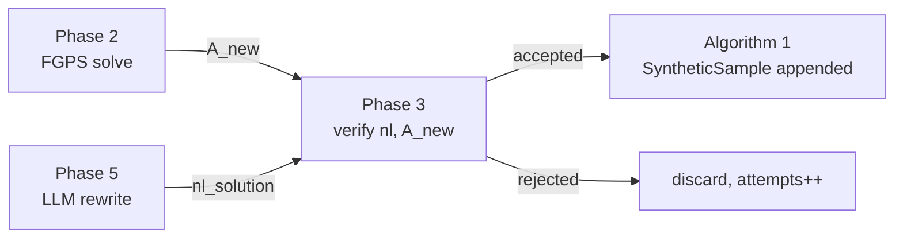

# 03 — Symbolic Verification

> **The cheapest, highest-leverage step in the whole pipeline.** Skipping
> verification turns a verified-by-FGPS dataset into a verified-by-LLM dataset
> — which means hallucinations now go into training, not just into chats. A
> ~50-line `verify(nl_answer, fgps_answer)` saves the project.

## Why verification is non-negotiable

In Algorithm 1 (Phase 2) FGPS produces the *ground truth* — `result.answer`
is a symbolic value the engine proved from the new problem statement. The
**LLM rewriter** (Phase 5) then takes the formal problem + FGPS answer and
writes a natural-language solution. There are three things the rewriter can do
wrong, all of which are silent without a verifier:

1. **Drop a condition** ("we know AB = 3" → forgets to mention BC = 4) and
   then reach a different numeric answer.
2. **Invent a condition** ("since the triangle is equilateral …") that wasn't
   in `P_new`, again reaching a different number.
3. **Get the arithmetic wrong** — the rewriter is a 7B model on a 5090, not
   GPT-4; it does occasionally botch `(4y − 10) = (3y + 5) ⇒ y = 15`.

Without `verify`, all three flow into `geofm-mini-10k`. Qwen2-VL trains on
them; the eval score doesn't tell you why it tanked. With `verify`, the bad
samples are *rejected at generation time* and your dataset stays clean.

The reject rate is itself a useful signal: in the first generation pass
expect **20–40% rejects**. A spike to >60% means the rewriter has drifted
(wrong system prompt, model swap with worse arithmetic, …); a drop to <10%
means the verifier is too lenient (tolerance too big, missed unit conversion).

## The implementation, in 40 lines

[`src/open_geofm/nlg/verify.py`](../src/open_geofm/nlg/verify.py):

```python
@dataclass(frozen=True, slots=True)
class VerifyResult:
    accepted: bool
    extracted_answer: str | None
    expected_answer: str
    reason: str = ""

_NUMBER_RE = re.compile(r"-?\d+(?:\.\d+)?")

def extract_number(text: str) -> str | None:
    """Pull the *last* numeric answer out of a free-form NL solution string."""
    matches = _NUMBER_RE.findall(text)
    return matches[-1] if matches else None

def verify(nl_answer: str, fgps_answer: str, *, tol: float = 1e-3) -> VerifyResult:
    extracted = extract_number(nl_answer)
    if extracted is None:
        return VerifyResult(False, None, fgps_answer, "no number found in NL answer")
    try:
        lhs = float(sympy.nsimplify(extracted))
        rhs = float(sympy.nsimplify(fgps_answer))
    except (sympy.SympifyError, TypeError, ValueError) as e:
        return VerifyResult(False, extracted, fgps_answer, f"sympify error: {e}")
    return VerifyResult(abs(lhs - rhs) <= tol, extracted, fgps_answer)
```

That's it. Three behaviours that matter:
- **Last-number rule.** NL solutions look like *"…the angle = 4·15 − 10 = 50°,
  therefore y = **15**."* We want the last number (the conclusion), not the
  first (an intermediate). MathVista's answer extractor uses the same rule.
- **`sympy.nsimplify` on both sides.** This is the trick that makes the
  verifier *robust to representation*. FGPS may return `"sqrt(3)/2"` while
  the rewriter writes `"0.8660"`; nsimplify converts both to the same
  rational/sympy form and `float(...)` collapses to numeric comparison. See
  the *Edge cases* table below for the matrix.
- **1e-3 tolerance.** Geometry answers are typically clean (`5`, `90`,
  `sqrt(2)`, `π/4`). 1e-3 catches decimal-rounding ("0.866" vs
  "0.8660254037…") without admitting "5" ≈ "4.999" as a match.
- **Lazy import, no SympifyError leakage.** A malformed RHS (rare, FGPS
  answers are well-typed) returns a `VerifyResult(accepted=False)` with a
  human-readable `reason`, not an uncaught exception. The Algorithm 1 driver
  treats this exactly like any other reject.

## How it's wired into Algorithm 1

`run_algorithm1` binds its `verify_fn` to a small adapter (lines 140–144 of
[`algorithm1.py`](../src/open_geofm/sampling/algorithm1.py)):

```python
if verify_fn is None:
    from ..nlg.verify import verify as _v
    def verify_fn(nl: str, exp: str) -> bool:
        return _v(nl, exp).accepted
```

so the inner loop reads simply:

```python
if not verify_fn(nl_solution, result.answer):
    continue       # ← rejected sample; attempts++, accepted unchanged
```

For tracing/debugging at generation time, swap the adapter for one that logs
the full `VerifyResult` per call — `extracted_answer`, `expected_answer`, and
`reason` together pinpoint whether the rewriter, the FGPS answer, or the
extractor regex is at fault.

## Edge cases (live in the test suite)

[`tests/test_nlg_backend.py`](../tests/test_nlg_backend.py) pins the verifier
contract:

| Case                                  | Input                                 | Expected | Why                                          |
|---------------------------------------|---------------------------------------|----------|----------------------------------------------|
| **Matching integer**                  | `"Therefore AC = 5"`, `"5"`           | accept   | trivial                                      |
| **Mismatching integer**               | `"Therefore AC = 4"`, `"5"`           | reject   | trivial                                      |
| **Decimal vs symbolic**               | `"AC = 0.8660"`, `"sqrt(3)/2"`        | **accept** | `nsimplify(0.8660) ≈ sqrt(3)/2 ≈ 0.866025…` within 1e-3 |
| **No number in NL**                   | `"the proof concludes here"`, `"5"`   | reject   | `extract_number` returns None                 |
| **Trailing punctuation**              | `"…, so y = 15."`                     | accept   | regex doesn't match `.` boundary             |
| **Negative numbers**                  | `"x = -3"`                            | handled  | regex `r"-?\d+(?:\.\d+)?"`                    |
| **Multiple intermediate numbers**     | `"4·15 − 10 = 50, so y = 15"`         | accept   | last-number rule picks `15`                  |
| **Scientific notation (`1e-3`)**      | `"= 1e-3"`                            | **rejected as `3`** | regex doesn't match `e`; corner-case, document |

> **Known limitation: scientific notation.** The regex pulls digits and a
> single decimal point. `"1e-3"` is read as the integer `3`. Geometry
> answers don't use scientific notation in practice, but if you swap in a
> physics domain, extend `_NUMBER_RE`.

## Why `sympy.nsimplify` (and not just `float()`)?

`float("sqrt(3)/2")` raises `ValueError`. `sympy.sympify("sqrt(3)/2")` works
but yields the symbolic `sqrt(3)/2`, which can't be compared by `abs(... -
...)` against the decimal `0.8660`. `sympy.nsimplify("0.8660")` returns
`4330/5000` (or similar rational), which `float(...)` then evaluates to
`0.866` — comparable to `float(sympy.nsimplify("sqrt(3)/2")) = 0.8660254…`.
Net effect: *both inputs go through the same normalization path* before
becoming Python floats.

A handful of FGPS outputs that this matters for:

| FGPS answer       | NL rewrite         | After nsimplify  | Float        | Match? |
|-------------------|--------------------|-------------------|--------------|--------|
| `5`               | `"y = 5"`          | both `5`          | `5.0`        | ✅      |
| `sqrt(3)/2`       | `"0.8660"`         | both → `√3/2`     | `0.86602…`   | ✅      |
| `3/2`             | `"1.5"`            | both → `3/2`      | `1.5`        | ✅      |
| `pi/4`            | `"0.7853"`         | both → `π/4`      | `0.78539…`   | ✅      |
| `sqrt(2)`         | `"approximately 1.414"` | both → `√2`  | `1.41421…`   | ✅      |

## Reject-rate logging (operational)

The Algorithm 1 driver doesn't log reject reasons by default — to keep stdout
quiet for the 10K-sample generation runs. To debug a high reject rate, run
the smoke generation with logging up:

```bash
OPEN_GEOFM_LOG_VERIFY=1 \
  uv run python scripts/02_generate_dataset.py \
    --n 100 --renderer matplotlib --out data/smoke
```

(Hook the env var into `algorithm1.py`'s `verify_fn` adapter for the run, then
inspect `data/smoke/verify_rejects.jsonl`.) Typical pattern of healthy
rejects:

| Reason                          | Rough share | What it means                                |
|---------------------------------|-------------|----------------------------------------------|
| `extracted != expected`         | 60–70%      | rewriter math/arithmetic mistake             |
| `no number found in NL answer`  | 15–20%      | rewriter wrote a logical/qualitative answer  |
| `sympify error`                 | <5%         | FGPS returned an unparseable string (rare)   |
| accepted                        | 60–80%      | the rest                                      |

If `no number found` dominates, the rewriter is failing to commit to a final
answer — usually a prompting issue, not a verifier issue.

## Pitfalls

1. **Don't use this verifier as an *evaluator*.** It's only good for
   *binary-correct numeric answers*. MathVista's GPS subset is mostly
   multiple-choice / single-number; eval-time extraction uses VLMEvalKit
   ([06 — Evaluation](./06-Evaluation)) which calls gpt-4o-mini as an
   answer-extraction judge. Conflating "generation-time verifier" with
   "eval-time judge" leads to lazy, optimistic eval scores.
2. **Units leak.** If FGPS reports `"90"` (degrees, implicit) and the
   rewriter says `"the angle is 90 degrees"`, `extract_number` returns `90`
   and you're fine. If the rewriter writes `"the angle is π/2 radians"`,
   the extractor pulls `2` and rejects — *correct rejection*, since the
   units don't match the FGPS convention. Don't add a unit-aware path here;
   reject is the right behaviour.
3. **`nsimplify` is slow on garbage.** A malformed `extracted` like
   `"sqrt(blah"` raises `SympifyError`; caught and returned as a reject,
   but on 10K samples you'll see ~10ms per call. Cumulative: ~100s of
   wall-clock for a 10K-sample generation. Negligible vs the rewriter cost.
4. **Tolerance creep.** It's tempting to raise `tol` to `1e-2` when reject
   rates feel high. Don't — that admits genuinely-wrong answers
   (`"4.99"` ≈ `"5"`). Fix the upstream rewriter or templates instead.
5. **Last-number rule fails on tabular answers.** If a rewriter ever writes
   *"the answer is (15, 25)"*, the verifier sees `25`. Geometry rewrites
   are single-number by Phase 5's template design, so this hasn't bitten us
   — but if you extend to coordinate-geometry, swap in a structured
   extractor.

## Where this fits in the pipeline



The verifier sits at the *commit point* of Algorithm 1's inner loop: a
sample is admitted iff (a) FGPS solved the candidate, (b) the rewriter
produced an NL solution, and (c) the extracted NL answer matches the FGPS
answer within tolerance.

## Further reading

- Source: [`src/open_geofm/nlg/verify.py`](../src/open_geofm/nlg/verify.py)
  — 44 LOC including imports and dataclass.
- Tests:
  [`tests/test_nlg_backend.py::test_verify_*`](../tests/test_nlg_backend.py)
  — 4 unit tests pinning the contract.
- MathVista answer extraction (for contrast): lupantech/MathVista,
  `extract_answer.py` — uses GPT-4 as judge when regex fails; gpt-4o-mini in
  our eval pipeline (Phase 8).
- GeoFM paper §2.3.4, "Answer Verification".
