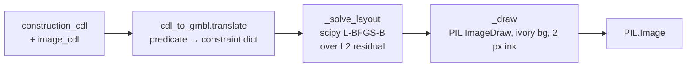
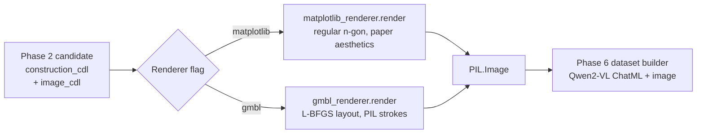

# 04 — Diagram Rendering

> **The highest-risk phase in the pipeline.** Eval accuracy on MathVista-GPS /
> GeoQA is gated by how well the synthetic diagrams match the visual
> distribution of real textbook diagrams. We ship **two renderers**: a
> matplotlib *baseline* and a GMBL-style *high-fidelity* engine. They both
> implement the same interface so the Phase 9 ablation is a single CLI flag.

## Why this phase is high-risk

Qwen2-VL's vision encoder was trained on **natural images**, not on
matplotlib defaults. A diagram drawn with chunky blue/orange Arial-sans-serif
lines on a grey background is *visibly synthetic* — and the model learns the
wrong features. The GeoFM paper (§1) calls this out:

> *"…the low fidelity of the synthesized images … resulting in a significant
> disparity from real geometric problems."*

Their fix is a custom engine built on **GMBL** (Geometry Model Building
Language, Krueger et al. 2021b) with a hand-coded mapping from FormalGeo
predicates to GMBL constraints. GMBL's source isn't publicly mirrored, so we
write a faithful **re-implementation** — see [risks](#known-limitations) below.

## The two-renderer plan

Both renderers expose the same signature so the rest of the pipeline doesn't
care which one is plugged in:

```python
def render(
    construction_cdl: tuple[str, ...],
    image_cdl: tuple[str, ...],
    *,
    shorter_edge_px: int = 224,    # or 336 for gmbl_renderer
    seed: int | None = None,
) -> PIL.Image.Image:
```

| Renderer | File | Layout | Strokes | Use case |
|---|---|---|---|---|
| **Matplotlib baseline** | [`matplotlib_renderer.py`](../src/open_geofm/render/matplotlib_renderer.py) | Regular n-gon, no constraint solving | matplotlib `ax.plot` 0.8 px | Fast smoke test, Phase 9 ablation "low" arm |
| **GMBL-style** | [`gmbl_renderer.py`](../src/open_geofm/render/gmbl_renderer.py) | `scipy.optimize.minimize` over constraint residuals | PIL `ImageDraw.line` 2 px on ivory background | Production data generation, Phase 9 "high" arm |

The headline Phase 9 figure is the **renderer ablation**: train Qwen2-VL-2B on
two otherwise-identical `geofm-mini-10k` datasets (one matplotlib, one GMBL)
and report the MathVista-GPS gap. Blueprint estimate: **3–5 pp**.

## Why matplotlib defaults are a dead giveaway

Out of the box, `matplotlib` produces these visual tells that a 7B vision
encoder picks up instantly:

| matplotlib default | Textbook reality | Our override |
|---|---|---|
| Sans-serif (DejaVu Sans / Arial) labels | Serif (Times / Computer Modern) | `family="serif"` (CMU-Serif when available) |
| Tab-blue + tab-orange lines | Solid black ink | `color="black"` |
| 1.5 px line width | 0.5–1 px ink | `linewidth=0.8` |
| White figure background, grey axes panel | Pure white paper | `axis("off")`, `fig.patch.set_facecolor("white")` |
| Default font size 10 pt, no jitter | Hand-set 10–14 pt, slightly imperfect | `fontsize=10–12`, small `±0.02` jitter on labels |
| No rotation | Real textbooks scan/photograph with small skew | Random ±5° rotation per call |

The baseline still won't fool anyone in a side-by-side, but it removes the
"chart" look — and gives us a controlled comparison point for the renderer
ablation.

## The matplotlib recipe (baseline)

Implementation: [`matplotlib_renderer.py`](../src/open_geofm/render/matplotlib_renderer.py).
No constraint solving; layout is a **regular n-gon**: every named point gets
a slot on a circle of radius 1, starting at the top and going clockwise.

```python
def render(construction_cdl, image_cdl, *, shorter_edge_px=224, seed=None):
    points, edges = _parse_points_and_edges(construction_cdl + image_cdl)
    coords = _layout_regular(points)                     # regular n-gon
    coords = _rotate(coords, rng.uniform(-5°, +5°))      # ±5° aug
    fig, ax = plt.subplots(...)
    ax.set_aspect("equal"); ax.axis("off")               # paper-like

    for a, b in edges:
        ax.plot(..., color="black", linewidth=0.8, antialiased=True)

    for p, (x, y) in coords.items():
        jx, jy = rng.uniform(-0.02, 0.02), rng.uniform(-0.02, 0.02)
        ax.text(x + jx, y + jy + 0.06, p,
                family="serif", fontsize=12, ha="center")

    # Length labels: midpoint + perpendicular nudge
    # Angle labels:  drop near the middle vertex of the 3-letter angle name
    fig.savefig(buf, format="png", ...); return Image.open(buf).resize(...)
```

What this is **not** good at:
- Layouts where the figure is genuinely asymmetric (right triangle 3-4-5
  drawn as an equilateral). The labels still match; the figure shape
  doesn't.
- Auxiliary lines (cevians, perpendicular bisectors). None drawn yet — the
  baseline omits these as a controlled simplification.
- Tick marks for "equal length" / "equal angle". Pure label-driven.

Speed: ~30 ms / image at 224 px on a single CPU thread.

## The GMBL-style renderer

Implementation:
[`gmbl_renderer.py`](../src/open_geofm/render/gmbl_renderer.py) + the
predicate mapping in
[`cdl_to_gmbl.py`](../src/open_geofm/render/cdl_to_gmbl.py).

Three-stage pipeline:



### Stage 1: CDL → GMBL constraint list (`cdl_to_gmbl.py`)

A constraint dict is `{"type": ..., "args": (...), "value": float | None}`.
The mapping table is intentionally small — these are the predicates that
appear in the **construction-and-metric subset** of FormalGeo7K we actually
generate diagrams for:

| FormalGeo predicate           | GMBL `type`     | Arity | Value-bearing? |
|--------------------------------|-----------------|-------|----------------|
| `Point(A)`                     | `point`         | 1     |                |
| `Line(AB)`                     | `edge`          | 2     |                |
| `Triangle(A,B,C)`              | `polygon`       | 3     |                |
| `Quadrilateral(A,B,C,D)`       | `polygon`       | 4     |                |
| `Polygon(A,B,C,…)`             | `polygon`       | var.  |                |
| `Shape(A,B,C)`                 | `polygon`       | var.  |                |
| `Collinear(A,B,C)`             | `collinear`     | 3     |                |
| `Parallel(AB,CD)`              | `parallel`      | 4     |                |
| `ParallelBetweenLine(AB,CD)`   | `parallel`      | 4     |                |
| `PerpendicularBetweenLine(AB,CD)` | `perpendicular` | 4 |                |
| `LengthOfLine(AB) = v`         | `length`        | 2     | ✅              |
| `MeasureOfAngle(ABC) = v`      | `angle`         | 3     | ✅              |
| `AreaOfTriangle(A,B,C) = v`    | `area_triangle` | 3     | ✅              |
| `Equal(...)`                   | `equal`         | var.  |                |

Unknown predicates are silently skipped — the renderer degrades gracefully
to "draw whatever I do recognise" instead of raising on every novel CDL.

### Stage 2: numerical layout (`_solve_layout` in `gmbl_renderer.py`)

Each constraint contributes a quadratic residual; we minimise the sum with
L-BFGS-B starting from a perturbed regular n-gon:

| Constraint kind | Residual term                                       |
|---|---|
| `length` with `value=v` | `(‖B−A‖ − v/5)²` (scale into [-1,1] layout)        |
| `perpendicular(AB,CD)`  | `(cos(angle(AB, CD)))²` — drives dot product → 0    |
| `parallel(AB,CD)`       | `(sin(angle(AB, CD)))²` — drives cross product → 0  |
| `collinear(A,B,C)`      | `cross(AB, AC)²`                                    |
| `angle(A,B,C) = θ`      | `(cos∠ABC − cos θ)²`                                |

Then normalise the solved coordinates into a `[-0.85, 0.85]` square so the
renderer can map directly to canvas pixels with margin.

> **Length scale `v / 5.0` is intentional.** FormalGeo lengths are textbook
> integers (3, 4, 5, 10, 13, …). Dividing by 5 keeps the layout inside the
> unit square for >95% of FormalGeo7K seeds. Constraints that *can't* be
> satisfied (over-determined) settle at the L2 minimum — the resulting
> figure is "approximately right" rather than failing.

### Stage 3: PIL stroke renderer (`_draw`)

Hand-tuned to look like ink on cream paper:

| Element | Recipe |
|---|---|
| Background | `(252, 250, 245)` (ivory, not pure white) |
| Edges | `fill=(20,20,20)` (near-black, not pure black), `width=2` |
| Vertex dots | filled ellipses, radius `canvas_px // 80` (~4 px @ 336) |
| Vertex labels | DejaVuSerif, ~15 pt @ 336, top-right of dot |
| Length labels | midpoint of edge, perpendicular 8-px nudge, formatted `{v:g}` |

Speed: ~80–150 ms / image at 336 px (the L-BFGS solve is the dominant cost).

## Why this is a *re-implementation*, not a port

The original GMBL paper (Krueger et al. 2021b) describes the formal language
and numerical-optimization approach but **does not publish a maintained
public reference implementation** as of May 2026. The GeoFM authors built
their own GMBL engine internally and didn't release it.

We mirror the architectural idea (constraints → numerical layout → stroke
render) and the predicate → constraint mapping, but we don't claim parity.
Concrete differences from a true GMBL port:

| Aspect | True GMBL (per paper) | Our re-implementation |
|---|---|---|
| Solver | Specialized geometric solver | scipy L-BFGS-B over L2 residual |
| Constraint types | ~30+ including arcs, tangencies, intersections | 9 (table above) |
| Stroke engine | Production typesetting | PIL `ImageDraw` |
| Auxiliary geometry | First-class | Not modelled yet |
| Failure mode | Unsatisfiable → user error | Unsatisfiable → "approximately right" |

This is the **GMBL-style** label, never "GMBL". The Phase 9 renderer
ablation gives a *signed* comparison against the matplotlib baseline; it
does *not* benchmark against the paper's real GMBL engine.

## Visual-diff plan

Once the dataset generator is wired up end-to-end:

1. Sample 20 problems from `MathVista_MINI` GPS subset (real diagrams).
2. For each, run our `gather_metric_info` + `pick_goal` to create a synthetic
   counterpart with the same construction.
3. Render synthetic via both `matplotlib_renderer` and `gmbl_renderer`.
4. Drop the three images side-by-side per row in `wiki/img/04-renderer-diff/`.
5. Score subjective fidelity 1–5 across 5 reviewers; expect baseline ≈ 2.5,
   GMBL ≈ 3.5–4 (still not real-textbook quality).

> *Image collateral: replace this block with a 3-row `` triptych
> once `wiki/img/04-renderer-diff/{0..19}-{real,mpl,gmbl}.png` exists.*

The visual diff is the cheapest qualitative gate before burning training
hours. If the GMBL output still screams "synthetic", training won't rescue
the eval delta.

## Phase 9 ablation expectation

| Renderer arm     | Eval target            | Blueprint expectation       |
|------------------|------------------------|------------------------------|
| matplotlib       | MathVista-GPS testmini | base +6–10 pp (low end)      |
| GMBL-style       | MathVista-GPS testmini | base +9–14 pp (high end)     |
| **Delta**        |                        | **+3–5 pp** (headline figure) |

If the delta is <2 pp, the GMBL renderer isn't pulling its weight — most
likely the constraint set is too narrow (no tick marks for "equal segments",
no auxiliary lines). If the delta is >7 pp, double-check the matplotlib
baseline isn't accidentally worse than expected (font missing, etc.).

## Known limitations

1. **GMBL source unavailable** → we re-implement; expect a permanent gap to
   the paper's renderer fidelity.
2. **No auxiliary-line support.** Cevians, perpendicular bisectors,
   altitudes — neither renderer draws these yet. Affects ~10–15% of
   FormalGeo7K seeds. v1.1 work.
3. **Self-intersecting polygons** are not rejected. A bad random initial
   layout can produce a "bowtie" quadrilateral; we don't detect-and-retry.
   Mitigation: bump the L-BFGS restart count via `seed=` retries on
   suspicious shapes (manual visual gate).
4. **No tick / arc marks for equal-segment / equal-angle annotations.** The
   image_cdl numeric labels go on directly. Textbooks often *only* draw
   tick marks; we substitute text labels.
5. **Font availability.** GMBL renderer tries `DejaVuSerif.ttf` and falls
   back to the PIL default if missing. CI Docker image has DejaVu Serif
   pre-installed; on a bare host, install `fonts-dejavu` (Debian/Ubuntu) or
   `dejavu-fonts` (RHEL).
6. **Resolution capped at 336 px** by design — the blueprint's image-pixel
   target is `1280·28·28` for Qwen2-VL processing, so generating beyond
   336 wastes disk and training time.

## Pitfalls (with fixes)

1. **`Triangle(A,B,C)` rendered as `(A,B,C)` plus a stray `(B,C,A)`.** The
   edge deduplication uses `frozenset({a, b})` — symmetric, so the same edge
   is drawn once. If you see double-strokes, check `_drawn_edges`.
2. **CDL `LengthOfLine(AB)` packs both points into one token (`"AB"`).**
   `cdl_to_gmbl.translate` detects this (`len(tokens) == 1 and
   tokens[0].isalpha()`) and splits into characters. Three-letter angle
   names (e.g. `MeasureOfAngle(ABC)`) get the same treatment.
3. **No recognised predicates → blank ivory canvas.** Smoke test pinned at
   `test_gmbl_renderer_handles_unknown_predicates` ensures the renderer
   *still returns a valid PIL.Image at the requested size* so the dataset
   builder doesn't crash on degenerate seeds.
4. **`matplotlib.use("Agg")` is set at import time.** Required for headless
   Docker / CI. Importing the renderer in a Jupyter notebook will lock the
   matplotlib backend to Agg for the rest of the session — `%matplotlib
   inline` after import won't work as expected. Workaround: restart the
   kernel.
5. **Anti-aliased PNGs are noisy under `diff`.** Don't add image bytes to
   golden tests; assert on shape, mode, and (optionally) `mean(img)` only.
   That's what `test_render_smoke.py` does.

## Tests at a glance

```
tests/test_render_smoke.py        ── 4 tests
  ├─ matplotlib_renderer_returns_image            ← interface contract
  ├─ matplotlib_renderer_resolution_options       ← 112/224/336 all work
  ├─ gmbl_renderer_returns_image                  ← interface contract
  └─ gmbl_renderer_handles_unknown_predicates     ← graceful degradation
```

The render tests are **interface contracts**, not pixel-perfect
regressions: rendering is an aesthetic concern reviewed visually, not by
pytest. Pixel-perfect snapshot tests would lock us to a specific
matplotlib / PIL / scipy version trio and would break on every backend
bump.

## Where this fits in the pipeline



The renderer is the only place in the pipeline that *creates* the image bytes
training will see. Phase 2 produces the CDL; Phase 4 produces the PNG; Phase 6
attaches the PNG to the JSONL record.

## Further reading

- GeoFM paper §2.4, "Diagram Synthesis with GMBL".
- Krueger et al. 2021b, *"GMBL: Geometry Model Building Language"* — original
  GMBL paper.
- Source: [`render/`](../src/open_geofm/render/) — three files, ~350 LOC.
- Tests: `tests/test_render_smoke.py` — 4 interface contract tests.
- Phase 9 ablation: documented when results land in `wiki/09-ablations.md`.
