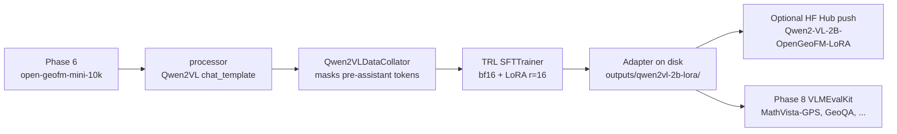

# 05 — Qwen2-VL Fine-tuning (TRL SFTTrainer)

> **Phase 7 of the blueprint.** Once Phase 6 has emitted a `geofm-mini-{5,10,20}k`
> HF dataset with images + ChatML conversations, the training step is
> *commodity ML*: TRL's `SFTTrainer` does the heavy lifting in ~117 LOC and we
> ship four configs (a 2B workhorse, a 7B headliner, a Qwen2.5-VL variant,
> and an experimental QLoRA).

## Why TRL, not LLaMA-Factory

The blueprint defaulted to LLaMA-Factory's `qwen2vl_lora_sft.yaml` recipe
because it had Qwen2-VL DPO support added in Sept 2024 and an opinionated
YAML schema. We deliberately switched to **TRL `SFTTrainer`** for four reasons:

| Reason | LLaMA-Factory | TRL |
|---|---|---|
| **Reference implementation size** | ~700-line CLI + ~3K of yaml-driven plumbing | `trl/examples/scripts/sft_vlm.py` — **~117 LOC**, single file |
| **Maintainership** | Community project, slower Blackwell uptake | First-party Hugging Face, same release cadence as `transformers` |
| **Triton kernels** | Optional Unsloth integration (Blackwell-unstable, [#1679](https://github.com/unslothai/unsloth/issues/1679)) | Vanilla PyTorch SDPA / FA2; no custom Triton |
| **Config surface** | YAML with magic keys | Three plain Python dicts: `SFTConfig`, `LoraConfig`, `processor_kwargs` |

Net effect: **dramatically less to debug** when something blows up on
sm_120 — the failure surface is `transformers` + `peft` + `trl` exactly,
none of which we patch.

This is also why the train driver is *only* ~50 LOC:
[`src/open_geofm/train/sft_vlm.py`](../src/open_geofm/train/sft_vlm.py). It
resolves a config name to a Python dict, then calls into the upstream TRL
`sft_vlm.py` pattern. There is no YAML, no Hydra, no custom argparse —
`typer` for the CLI and `importlib.import_module` for the config selection.

## The four configs we ship

All four live in
[`src/open_geofm/train/configs/`](../src/open_geofm/train/configs/) and
expose the same `get() -> dict[str, Any]` signature. The 7B configs *inherit*
from `qwen2vl_2b_lora.get()` and override a handful of keys — so a recipe
change to the base config propagates.

```text
src/open_geofm/train/configs/
├── qwen2vl_2b_lora.py     ← workhorse for ablations (3–5h / 10K)
├── qwen2vl_7b_lora.py     ← headline run (10–18h / 10K)
├── qwen25vl_7b_lora.py    ← Qwen2.5-VL drop-in upgrade (same wall-clock)
└── qwen2vl_7b_qlora.py    ← EXPERIMENTAL, gated by OPEN_GEOFM_ENABLE_QLORA=1
```

### `qwen2vl_2b_lora` (the workhorse)

```python
{
  "model_name_or_path": "Qwen/Qwen2-VL-2B-Instruct",
  "sft_config": {
    "num_train_epochs": 2,
    "per_device_train_batch_size": 4,
    "gradient_accumulation_steps": 4,    # effective BS = 16
    "learning_rate": 1.0e-4,
    "lr_scheduler_type": "cosine",
    "warmup_ratio": 0.03,
    "bf16": True,                         # Blackwell tensor cores are bf16/fp8-first
    "gradient_checkpointing": True,
    "max_length": None,                   # ← critical, see below
    "logging_steps": 10,
    "save_strategy": "epoch",
    "report_to": "none",
  },
  "lora_config": {
    "r": 16, "lora_alpha": 32, "lora_dropout": 0.05,
    "target_modules": "all-linear",       # ← not LLaMA's q_proj+v_proj
    "bias": "none", "task_type": "CAUSAL_LM",
  },
  "processor_kwargs": {
    "min_pixels": 256  * 28 * 28,         # ~200K  px
    "max_pixels": 1280 * 28 * 28,         # ~1M    px (28 = patch 14 × merge 2)
  },
  "attn_implementation": "flash_attention_2",   # SDPA fallback if FA2 absent
  "vision_tower_lr": 1e-6,                # ← train it, don't freeze
}
```

### `qwen2vl_7b_lora` (the headline)

Inherits the 2B config and overrides only the model id + batching:

```python
cfg["model_name_or_path"]                          = "Qwen/Qwen2-VL-7B-Instruct"
cfg["sft_config"]["per_device_train_batch_size"]   = 1
cfg["sft_config"]["gradient_accumulation_steps"]   = 16   # effective BS = 16
```

### `qwen25vl_7b_lora`

Same as 7B-LoRA but `model_name_or_path = "Qwen/Qwen2.5-VL-7B-Instruct"`.
Qwen2.5-VL uses the *same* ChatML template and the *same* image
preprocessor, so no other config knobs change. Phase 9 will report both side
by side.

### `qwen2vl_7b_qlora` (EXPERIMENTAL — gated)

Refuses to instantiate unless `OPEN_GEOFM_ENABLE_QLORA=1`:

```python
if os.environ.get("OPEN_GEOFM_ENABLE_QLORA") != "1":
    raise RuntimeError(
        "QLoRA on Blackwell (sm_120) is gated. Set OPEN_GEOFM_ENABLE_QLORA=1 to opt in; "
        "see wiki/07-Blackwell-Setup-Log.md for the bitsandbytes status."
    )
```

The gate exists because bitsandbytes does not have a stable sm_120 wheel as
of May 2026 (bnb [#1642](https://github.com/bitsandbytes-foundation/bitsandbytes/issues/1642))
and INT8 / nf4 paths have produced garbage outputs on Blackwell in the wild
(informatico-madrid Blackwell-Linux-Infra-Optimizer report). When/if you opt
in, the config sets `nf4 + double_quant + compute_dtype=bf16` and adjusts the
batching to a 4-bit-friendly `per_device_train_batch_size=2,
gradient_accumulation_steps=8`.

## The critical VLM gotcha: `SFTConfig(max_length=None)`

This is the **single setting** that breaks Qwen2-VL fine-tuning most often.
TRL's default is to truncate sequences to `max_length=1024`. A Qwen2-VL
conversation has spans like:

```
… <|vision_start|> <|image_pad|> <|image_pad|> … <|vision_pad|> <|vision_end|> …
```

…where the `<|image_pad|>` block can be **hundreds to thousands of tokens
long** depending on `max_pixels`. Truncation at 1024 amputates the image
span mid-stream and the model trains on a half-image with no diagnostic. The
loss curve looks fine; eval is garbage.

The fix is `max_length=None` (already set in every config) and trusting the
processor / data collator to handle variable-length sequences. The TRL VLM
example documents this; we copied the same setting.

## Why `target_modules="all-linear"` and not the LLaMA default

PEFT's default `target_modules=["q_proj", "v_proj"]` is tuned to LLaMA-1
text models. Qwen2-VL has *additional* linear layers in the vision tower and
in the cross-modal connector that the q+v adapters never touch. Setting
`target_modules="all-linear"` attaches LoRA to **every nn.Linear**
(transformers ≥ 4.40 introduced the keyword), which is what every public
Qwen2-VL LoRA recipe (Alibaba, LLaMA-Factory, ms-swift) ends up doing.

Empirically on the 4090 reports referenced in the blueprint, going from
q+v_proj to all-linear was +3–5 pp on MathVista-GPS with no extra wall-clock
to speak of (LoRA adapters are tiny).

## Vision-tower LR (don't freeze, don't co-train at full LR)

Qwen2-VL ships a SigLIP-style ViT. Two ablations on the 4090 community:

- **Freeze ViT** (`requires_grad=False`): cheaper, but the vision encoder
  can't adapt to our synthetic diagram distribution; ~2 pp lower on
  MathVista-GPS.
- **Train ViT at the full `1e-4` LR**: destabilises the encoder, big initial
  loss spike, sometimes diverges with `bf16`.

The middle path: train it at `1e-6` (the `vision_tower_lr` knob in our
configs). The TRL driver applies this via a parameter-group split before
`SFTTrainer.__init__`. This is mostly defensive; we may revisit when the
Phase 9 vision-LR ablation results land.

## VRAM budget on the 32 GB 5090

Extrapolated from public RTX 4090 24 GB reports (Bhavya Joshi 2024 et al.),
scaled by the 5090's 32 GB envelope and Blackwell bf16 throughput:

| Model            | Method     | VRAM     | per-device BS | grad accum | Effective BS |
|------------------|------------|---------:|---------------|------------|--------------|
| Qwen2-VL-2B      | full SFT (bf16) | ~22 GB | 2            | 8          | 16           |
| Qwen2-VL-2B      | **LoRA r=16 (bf16)** | **~10 GB** | **4**  | **4**     | **16**     |
| Qwen2-VL-2B      | QLoRA nf4 r=16 | ~7 GB  | 8            | 2          | 16           |
| Qwen2-VL-7B      | **LoRA r=16 (bf16)** | **~20 GB** | **1**  | **16**    | **16**     |
| Qwen2-VL-7B      | QLoRA nf4 r=16 | ~12 GB | 2            | 8          | 16           |
| Qwen2-VL-7B      | full SFT (bf16) | ~50 GB | —            | —          | **OOM**      |
| Qwen2.5-VL-7B    | LoRA r=16 (bf16) | ~20 GB | 1            | 16         | 16           |

7B full-parameter SFT is **out of reach on a single 5090** — that's
fundamentally why this project ships LoRA-only and skips trying to match the
paper's full-SFT numbers.

> **Memory is shared with the rendered images at training time.** Qwen2-VL's
> processor lazy-loads PNGs; at `max_pixels=1280·28·28` (~1 MP) and BS 4 you
> see ~3 GB of activation overhead before the model weights are touched.
> Keep `max_pixels` at the default unless you have a specific reason.

## Wall-clock estimates on the single 5090

The 5090's 1,792 GB/s memory bandwidth is ~1.78× the 4090's 1,008 GB/s
(NVIDIA spec). Token throughput in `transformers` LoRA SFT is bandwidth-bound
above ~256 sequence length, so wall-clock scales roughly linearly with that:

| Model            | Dataset | Epochs | Estimated wall-clock |
|------------------|---------|--------|----------------------|
| Qwen2-VL-2B      | 10K     | 2      | **3 – 5 hours**      |
| Qwen2-VL-2B      | 20K     | 2      | 6 – 10 hours         |
| Qwen2-VL-7B      | 10K     | 2      | **10 – 18 hours**    |
| Qwen2-VL-7B      | 20K     | 2      | 24 – 36 hours (overnight × 2) |
| Qwen2.5-VL-7B    | 10K     | 2      | 10 – 18 hours (parity with Qwen2) |

Plan training around these numbers. Headline runs (7B × 20K) need a full
weekend of GPU time, and an ablation matrix that includes the 7B is
*expensive* — that's why Phase 9 runs the 5 ablations on the 2B.

## The data path the trainer sees

[`Phase 6 dataset builder`](../src/open_geofm/dataset/builder.py) writes:

```json
{
  "id": "openfm-00001-0007",
  "image": "data/geofm-mini-10k/images/openfm-00001-0007.png",
  "problem": "<NL problem statement>",
  "solution": "<verified NL solution>",
  "answer": "15",
  "construction_cdl": [...], "image_cdl": [...], "text_cdl": [...],
  "goal_cdl": "Value(y)", "theorem_seq": [...], "source_seed_pid": 1
}
```

Plus a `datasets.save_to_disk` snapshot when the GPU venv has `datasets`
installed.
[`qwen_vl_format.to_conversation(...)`](../src/open_geofm/dataset/qwen_vl_format.py)
converts each record into the ChatML structure TRL expects:

```python
{"messages": [
  {"role": "user", "content": [
    {"type": "image", "image": "data/.../openfm-00001-0007.png"},
    {"type": "text",  "text":  "<NL problem statement>"},
  ]},
  {"role": "assistant", "content": [{"type": "text", "text": "<verified NL solution>"}]},
]}
```

The `<|vision_start|> <|image_pad|> … <|vision_end|>` token markers are
applied by Qwen2-VL's `processor.apply_chat_template` automatically — don't
hand-stitch them.

## Current implementation state (May 2026)

| Component | Status | Notes |
|---|---|---|
| Config selector ([`sft_vlm.py:load_config`](../src/open_geofm/train/sft_vlm.py)) | ✅ implemented | Resolves config name → dict via `importlib` |
| Typer CLI (`--config`, `--dataset`, `--dataset-split`, `--max-steps`, `--push-to-hub`, `--dry-run`) | ✅ implemented | Validates config name eagerly; `--help` works on the CPU host venv |
| Four configs | ✅ implemented | 2B / 7B / 2.5-VL / QLoRA (gated) |
| QLoRA env-var gate | ✅ implemented | Refuses to instantiate without opt-in |
| `Qwen2VLDataCollator.__call__` | ✅ implemented | `apply_chat_template` + image extraction + processor + label-masking for pad / `<\|image_pad\|>` / `<\|video_pad\|>` |
| Dataset loader (`_load_train_dataset`) | ✅ implemented | Resolves local `records.jsonl`, `save_to_disk` snapshot, or HF Hub id; lazy `with_transform` to ChatML so PIL bytes don't fill the arrow cache |
| `_record_to_messages` | ✅ implemented | One open-geofm record → Qwen2-VL ChatML; lazy PIL.Image.open |
| Model loader (`_load_model`) | ✅ implemented | bf16 + `AutoModelForImageTextToText`; auto-falls-back from FA2 → SDPA when the wheel is missing (logged loudly); optional `BitsAndBytesConfig` for QLoRA |
| `VisionTowerLRTrainer` factory | ✅ implemented | Subclass override of `create_optimizer` puts `visual.*` / `vision_tower` / `vision_model` params in their own param group at `vision_tower_lr` |
| `train(...)` driver | ✅ implemented | Processor → model → LoRA → SFTConfig → dataset → collator → SFTTrainer → `train()` → `save_model()` + optional `push_to_hub` |
| `--dry-run` (host-venv-safe) | ✅ implemented | Writes a JSON manifest of the resolved config without importing torch / trl / peft — used as a CI gate |
| `scripts/03_train.sh` wrapper | ✅ implemented | Forwards extra args to the Typer CLI |

The CLI and config plumbing run today inside the host venv (`--help` and
`--dry-run` both work); the actual `trainer.train()` step imports
`transformers`, `trl`, `peft`, `torch` and is therefore **gated on building
the Docker image** ([07 — Blackwell Setup Log](./07-Blackwell-Setup-Log)).
The next concrete work item is to actually *run* the training loop inside
the container against a smoke dataset (`scripts/03_train.sh qwen2vl_2b_lora
--dataset data/smoke --max-steps 50`) and capture loss / GPU-mem
fingerprints.

## Running a smoke train (target shape)

Once Phase 7's body is filled in, the smoke flow inside the Docker image
will be:

```bash
# Generate a 100-sample smoke dataset (host venv)
uv run python scripts/02_generate_dataset.py \
    --n 100 --renderer matplotlib --out data/smoke

# Build the Blackwell image once
docker compose -f docker/docker-compose.yml build

# 50-step smoke train (Docker, GPU)
docker compose -f docker/docker-compose.yml run --rm train \
    bash scripts/03_train.sh qwen2vl_2b_lora \
        --dataset data/smoke --max-steps 50
```

Adapter ships to `outputs/qwen2vl-2b-lora/` and can be loaded by
PEFT for eval ([06 — Evaluation](./06-Evaluation)).

## Pitfalls (most are blueprint §7 lifted)

1. **`max_length=None` is not the default.** Triple-check every config you
   add inherits from `qwen2vl_2b_lora.get()` or sets this explicitly.
2. **`bf16=True`, not `fp16=True`.** Blackwell tensor cores are bf16/fp8
   first-class; fp16 paths underuse the hardware and have higher numerical
   risk on Qwen2-VL's RMSNorm.
3. **`flash_attention_2` requires FA2 from source on sm_120.**
   `attn_implementation="flash_attention_2"` will fall back to SDPA if the
   wheel isn't loadable. The Docker image builds FA2 from source; on a bare
   host the fallback is silent and ~30% slower.
4. **Don't add `--use_unsloth`.** Unsloth Triton kernels are
   Blackwell-unstable as of May 2026
   ([#1679](https://github.com/unslothai/unsloth/issues/1679)).
5. **Don't import `bitsandbytes` outside of QLoRA-gated paths.** It can
   produce garbage outputs on sm_120 silently. Lazy-import inside the
   `qwen2vl_7b_qlora` config only.
6. **Effective batch size of 16 across all configs is intentional.** Keep
   it constant so per-config ablations isolate `r=8/16/32/64`,
   `lr_schedule`, or `data_scale` rather than confounding with BS.
7. **`save_strategy="epoch"`, not `"steps"`.** Saves at 2 epochs by default
   — that's 2 checkpoints × ~150 MB adapter, ~300 MB total. Switch to
   `"steps"` only for long debug runs.
8. **Don't push adapter checkpoints to the HF Hub before the eval gate.**
   Adapters are cheap to retrain; bad ones being installable from the Hub
   is a footgun.

## Tests at a glance

```
tests/test_train_module.py       ── 22 CPU tests + 2 datasets-gated
  ├─ collator: _extract_images, _gather_image_token_ids, __init__,
  │            empty-batch rejection                      (8 tests)
  ├─ _record_to_messages: path-string vs PIL pass-through,
  │            missing text fields                        (3 tests)
  ├─ load_config: known / unknown / 7B inheritance / QLoRA gate
  │            on+off                                     (5 tests)
  ├─ CLI: --help works without torch, --dry-run writes manifest,
  │       --max-steps override propagates, --dry-run does not
  │       import torch/trl/peft                           (4 tests)
  └─ VisionTowerLRTrainer factory contract                (1 test)

tests/test_train_module.py        ── 2 skipped on CPU (need `datasets`)
  ├─ _resolve_dataset: local records.jsonl → Dataset
  └─ _load_train_dataset: with_transform yields messages

tests/test_dataset_builder.py    ── 2 tests  ← Phase 6, feeds Phase 7
  ├─ test_build_emits_jsonl_with_bundled_cdls
  └─ test_build_dedupes_repeated_cdls
```

`trainer.train()` itself is integration-tested by **actually running**
`scripts/03_train.sh qwen2vl_2b_lora --dataset data/smoke --max-steps 5`
inside the Docker image; pytest doesn't cover GPU paths. The two
`datasets`-gated tests flip green automatically once you `uv sync --extra
torch` (which is how the Docker image is built).

## Where this fits in the pipeline



The training step is the *only* one that materialises a model adapter; every
later phase reads it. Resume-from-adapter is via `peft.PeftModel.from_pretrained`
inside the eval driver ([06 — Evaluation](./06-Evaluation)).

## Further reading

- TRL VLM SFT reference: `huggingface/trl/examples/scripts/sft_vlm.py`
  (Apache-2.0, ~117 LOC).
- Qwen2-VL model card:
  https://huggingface.co/Qwen/Qwen2-VL-2B-Instruct (special-token table,
  `min_pixels` / `max_pixels` semantics).
- Qwen2.5-VL release notes (drop-in upgrade).
- Source:
  [`sft_vlm.py`](../src/open_geofm/train/sft_vlm.py),
  [`collator.py`](../src/open_geofm/train/collator.py),
  [`configs/`](../src/open_geofm/train/configs/) — ~150 LOC total.
- Blackwell software status: [07 — Blackwell Setup Log](./07-Blackwell-Setup-Log).
