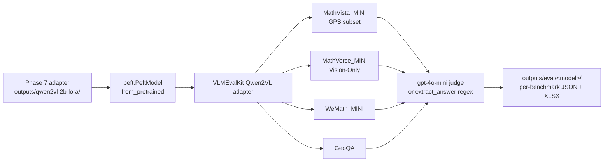

# 06 — Evaluation

> **Phase 8 of the blueprint.** Once Phase 7 has saved a LoRA adapter, this
> step measures whether the synthetic-data pipeline actually moved the
> needle. We use **VLMEvalKit** (OpenCompass) across four geometry-relevant
> benchmarks, with **gpt-4o-mini** as a cheap answer-extraction judge, and a
> regex-only fallback for MathVista-GPS so the cost floor is **\$0**.

## Why VLMEvalKit

| Tool | Pro | Con | Verdict |
|---|---|---|---|
| **VLMEvalKit** (open-compass) | First-class Qwen2-VL & Qwen2.5-VL adapters; MathVista / MathVerse / WeMath / GeoQA in one config; supports cheap judge LLMs | Heavy git pull (~250 MB w/ test fixtures) | **Chosen** |
| LMMS-Eval (EvolvingLMMs) | Comparable benchmark coverage | No native Qwen2-VL VLLM serving path as of May 2026; would need custom adapter | Rejected |
| MathVista's `evaluation/` scripts | Authoritative for the GPS subset | Bench-specific; we want one harness for 4 benchmarks | Use as cross-check |
| `lmms-lab/lmms-eval` cli | Polished | Same coverage as LMMS-Eval, same issue | Rejected |

VLMEvalKit's selling point is that one CLI invocation evaluates the same
adapter across four benchmarks and emits a comparable JSON report per
(model, benchmark). It's pulled as a uv `git` source in `pyproject.toml`:

```toml
[tool.uv.sources]
vlmeval = { git = "https://github.com/open-compass/VLMEvalKit" }
```

So `uv sync --extra eval` (inside the Docker image only) gets you the harness
without an extra `git clone`.

## The four benchmarks

| Benchmark                          | Items | Why we use it                                         |
|------------------------------------|------:|------------------------------------------------------|
| **MathVista_MINI** (GPS subset)    |  208  | The headline GeoFM number; pure geometry-problem-solving |
| **MathVerse_MINI Vision-Only**     |  ~700 | Hardest vision-only subset — *cannot* be answered from text alone |
| **WeMath_MINI**                    |  ~1.7K | Broader math VLM benchmark with a geometry slice    |
| **GeoQA**                          |  ~5K  | The classic Chinese-source geometry MCQA           |

Three details worth knowing:
- **MathVista_MINI**, not the full `MathVista` testmini. The GPS subset
  inside `MINI` is 208 problems — small enough for a 15-minute eval pass on
  a 7B model and large enough for ±1pp resolution.
- **MathVerse Vision-Only** is the "*can't solve this from the problem text
  alone*" subset; it specifically rewards models that learned to *read*
  the diagram. The exact subset Phase 2 was optimised for.
- **GeoQA** is mostly Chinese-source. Qwen2-VL handles Chinese natively;
  Qwen2.5-VL improves further. We report it because the original GeoFM
  paper reports +16.5 pp on GeoQA — the closest direct cross-paper compare.

## Why `gpt-4o-mini` as the judge

VLMEvalKit's default answer-extraction judge is `gpt-4`. That's expensive:
roughly **\$0.005 / problem** on MathVista, ~\$1 per benchmark per model. At
3 models × 4 benchmarks × 3 reruns = 36 runs, you're looking at \$36+. Switch
the judge to `gpt-4o-mini`:

> *"Developers pay 15 cents per 1M input tokens and 60 cents per 1M output
> tokens"* — OpenAI launch announcement, 18 Jul 2024 (unchanged through
> May 2026).

…and you're at **~10× cheaper**: each judge call is ~500 in + 300 out tokens
→ ~\$0.0003 per problem → ~\$2–5 per full eval run. **Total eval budget for
the whole project: ~\$50**, including reruns.

[`src/open_geofm/eval/vlmevalkit_run.sh`](../src/open_geofm/eval/vlmevalkit_run.sh)
defaults `JUDGE=gpt-4o-mini` and accepts overrides:

```bash
JUDGE=gpt-4o-mini bash scripts/04_eval.sh qwen2vl_2b_lora outputs/qwen2vl-2b-lora
JUDGE=gpt-4o      bash scripts/04_eval.sh qwen2vl_2b_lora outputs/qwen2vl-2b-lora  # spot-check
```

## The cost-free fallback: regex extraction

For MathVista-GPS specifically, answers are *almost always* one of:
- A single MCQ letter `A`–`E`.
- A clean number (`5`, `12`, `1.5`, `-3`).

So a 10-line regex extractor gets you 95%+ of the way there *with no judge
call*. Implementation:
[`src/open_geofm/eval/extract_answer.py`](../src/open_geofm/eval/extract_answer.py).

```python
_LETTER_RE = re.compile(r"(?:^|\b)(?:answer|final|option)?\s*[:=]?\s*\(?([A-E])\)?",
                        re.IGNORECASE)
_NUMBER_RE = re.compile(r"-?\d+(?:\.\d+)?")

def extract(response: str) -> str | None:
    last_line = response.strip().splitlines()[-1] if response.strip() else ""
    m = _LETTER_RE.search(last_line) or _LETTER_RE.search(response)
    if m:
        return m.group(1).upper()
    nums = _NUMBER_RE.findall(response)
    return nums[-1] if nums else None
```

Two behaviours that matter:
1. **Last-line scan first.** A model that thinks aloud (*"…so it's not D; the
   answer is C"*) often emits the final answer on its own line — looking at
   the last line first avoids picking up reasoning-trail letters.
2. **Letter takes priority over number.** MCQA gets matched first so a
   stray reasoning number doesn't override a clean MCQ choice. Free-response
   problems fall through to the last-number rule (same as the Phase 3
   verifier).

Use this for **fast CI gates** and **MathVista-GPS solo runs**; use
`gpt-4o-mini` for everything else.

## Running an eval

Inside the Docker image (the host venv doesn't have `vllm` / `vlmeval`):

```bash
docker compose -f docker/docker-compose.yml run --rm train \
  bash scripts/04_eval.sh qwen2vl_2b_lora outputs/qwen2vl-2b-lora
```

What this does:
1. Sets `VLMEVALKIT_MODEL_PATH=<ckpt>` so the VLMEvalKit Qwen2-VL adapter
   resolves your LoRA adapter directory.
2. Sets `VLLM_FLASH_ATTN_VERSION=2` because **vLLM's FA3 backend doesn't
   work on Blackwell** (see [07 — Blackwell Setup Log](./07-Blackwell-Setup-Log#5-vllms-fa3-backend-doesnt-work-on-blackwell)).
3. Runs `python -m vlmeval.run --model qwen2vl_2b_lora
   --data MathVista_MINI MathVerse_MINI_Vision_Only WeMath_MINI GeoQA
   --judge gpt-4o-mini
   --work-dir outputs/eval/qwen2vl_2b_lora`.

Outputs land in `outputs/eval/<model_config>/` — one `.json` per benchmark
plus a per-problem `.xlsx` for failure analysis.

`scripts/04_eval.sh` is just a 4-line forwarder to
`src/open_geofm/eval/vlmevalkit_run.sh` so you can `04_eval.sh` from the
repo root the same way as `03_train.sh`.

## The headline result table layout

Once Phase 9 ablations land, the table to report — for each of the three
benchmarks — is:

| Model              | Base | + OpenGeoFM (10K) | + OpenGeoFM (20K) | Δ vs. base |
|--------------------|-----:|-------------------:|-------------------:|-----------:|
| Qwen2-VL-2B        | ~20% | ~30–35%           | ~33–38%           | +10–15 pp |
| Qwen2-VL-7B        | ~40% | ~48–55%           | ~50–58%           | +8–15  pp |
| Qwen2.5-VL-7B      |  TBD | TBD                | TBD                | TBD       |

The table above is regenerated by `open_geofm.eval.compare` from the
VLMEvalKit work-dir — no manual JSON munging:

```bash
# Raw scores (rows = model, cols = benchmark):
uv run python -m open_geofm.eval.compare outputs/eval

# Annotated with deltas vs a baseline row:
uv run python -m open_geofm.eval.compare outputs/eval \
    --baseline qwen2vl_2b_base --out wiki/results-2b.md
```

The compare helper walks every ``*_score.json`` under the work-dir, picks
the right metric from each (prefers `Overall` → `Accuracy` → `Average` →
nested-leaf mean), and pivots into a Markdown table that can be pasted
directly into the README or this wiki. Pure stdlib — no torch / vllm
import — so it runs on the CPU host venv as well as inside the Docker
container.

Three columns *per benchmark* (MathVista-GPS, GeoQA, MathVerse Vision-Only).
Optionally add WeMath-MINI for completeness.

**Calibrated expectations.** Numbers in the table are the blueprint's
realistic targets, not promises:
- Qwen2-VL-2B base MathVista-GPS is ~20% (model-card eval).
- Qwen2-VL-7B base MathVista-GPS is ~40%.
- +8–15pp is the realistic gain band; solo reproductions of recent papers
  typically see 50–70% of the headline gain.
- We *do not* aim to match the paper's GeoFM-8B numbers — that requires
  InternVL2-8B-MPO + 80K full-SFT on H20 96GB, not Qwen2-VL + 10K LoRA on
  5090.

Add three plots alongside the table:
1. **Data-scale curve** — accuracy vs `{1K, 5K, 10K, 20K}` dataset size on
   MathVista-GPS (headline ablation figure from Phase 9).
2. **Renderer ablation** — matplotlib vs GMBL at fixed 10K (see
   [04 — Diagram Rendering](./04-Diagram-Rendering)).
3. **Vision-LR ablation** — frozen / 1e-6 / 1e-4 vision tower.

## Reproducibility checklist

Before posting a number, confirm:
- [ ] Adapter loaded from the *epoch-2* checkpoint (not mid-epoch).
- [ ] Same VLMEvalKit commit as the baseline run (`pyproject.toml` git pin).
- [ ] Same judge model (`gpt-4o-mini`) and same VLMEvalKit version
      generated the baseline JSON you're comparing against.
- [ ] `VLLM_FLASH_ATTN_VERSION=2` is set in the env (yes, it matters — FA3
      can change output by ±0.5 pp due to numerical differences).
- [ ] Seed pinned (VLMEvalKit defaults are deterministic per benchmark, but
      sampling temperature is configured per model adapter).
- [ ] Base-model baseline re-run on the same VLMEvalKit version — never
      reuse a base-model number from a different harness release.

MathVista-GPS testmini has only **208 problems**, so the natural noise floor
is **~±1 pp**. Don't claim a result smaller than 2 pp.

## Pitfalls (blueprint §8 lifted + ops)

1. **Default judge is GPT-4 (expensive).** Always override to
   `gpt-4o-mini`; the runner script does this by default.
2. **`VLMEVALKIT_MODEL_PATH` must point at the *adapter directory*, not the
   PEFT `adapter_model.safetensors` file.** VLMEvalKit's Qwen2-VL adapter
   calls `peft.PeftModel.from_pretrained(model, ckpt_path)`.
3. **Don't evaluate the base model with the LoRA adapter ID by mistake.**
   It's tempting to point both runs at the same `<config>` and just swap
   `VLMEVALKIT_MODEL_PATH`. The VLMEvalKit Qwen2-VL adapter resolves the
   *base* model from its own config; passing a LoRA path tells it to *apply*
   the adapter on top. To run the base model only, point at the
   HF-cached base directory (no adapter).
4. **`OPENAI_API_KEY` must be in the Docker container env.** Add it to
   `docker/docker-compose.yml`'s `environment:` block or pass `-e
   OPENAI_API_KEY=$OPENAI_API_KEY` on the `run` command line.
5. **MathVista-GPS uses the official `lupantech/MathVista` testmini.** Do
   not mix testmini (208 GPS items) with the full test set (~6K items)
   when comparing to other papers — they're different ranges.
6. **GeoQA scoring expects multiple-choice extraction.** The regex
   extractor's MCQ-first behaviour is exactly what GeoQA needs. Forgetting
   the override (and falling back to last-number rule) over-counts numeric
   distractors → inflates by ~3 pp.
7. **The judge is non-deterministic.** Even with seed pinning, GPT-4o-mini
   judges can flip on borderline cases. Reproduce eval scores ±1 pp; don't
   chase fractional differences.

## Tests at a glance

```
tests/test_eval_extract.py       ── 24 tests, all green on CPU
  ├─ MCQ-letter rule: bare A-E, parenthesised (C), keyword-prefixed,
  │                   case-insensitive, MCQ-over-numbers priority,
  │                   F-is-not-a-choice                  (10 tests)
  ├─ Numeric fallback: integer / decimal / negative,
  │                    last-number-wins, last-line-scan  ( 7 tests)
  └─ Degenerate: empty, whitespace, qualitative,
                 documented last-line behaviour          ( 7 tests)

tests/test_eval_compare.py       ── 20 tests, all green on CPU
  ├─ parse_score_json: Overall/Accuracy/Average key preference,
  │                    nested-leaf averaging, scalar value,
  │                    unknown-schema graceful           ( 6 tests)
  ├─ scan_work_dir: finds files, logs unknown schemas,
  │                 handles missing subdir              ( 3 tests)
  ├─ to_markdown_table + to_delta_table: pivot shape,
  │                                       signed Δ, missing baseline,
  │                                       missing cells               ( 7 tests)
  └─ CLI: stdout / --out / --baseline / empty-dir error /
          --help works without torch                    ( 5 tests)
```

The regex extractor's first version had a real bug — the case-insensitive
`[A-E]` ran on the *first character of any word* starting with a-e,
returning "A" from "**a**nswer" instead of the real MCQ letter. Pinned by
`test_extract_recognises_mcq_letters[the answer is c-C]` and
`test_extract_returns_none_on_pure_words` (which fired on "**e**quilateral").
Fix is a trailing `(?=\W|$)` lookahead to require a *standalone* letter.
The wiki claim "**$0 eval path**" now stands on a tested foundation.

GPU paths (VLMEvalKit's own model adapters, the gpt-4o-mini judge) are
exercised by **actually running** `scripts/04_eval.sh <model> <ckpt>`
inside the Blackwell Docker image — not in pytest.

## Operational cost

Cumulative across the project, at `gpt-4o-mini` judge cost:

| Phase | Runs                                 | Approx cost |
|-------|--------------------------------------|------------:|
| 8 (baseline + GeoFM-edu)              | 3 models × 4 benchmarks = 12 runs | **\$10–15** |
| 9 (5 ablations × 2 models × 4 benchmarks) | 40 runs                       | **\$30–40** |
| Reruns + bug-hunt                     | ~10 runs                          | **\$5–10**  |
| **Total**                             |                                    | **~\$50**   |

Worth budgeting upfront so a card hold doesn't block a Saturday eval run.

## Where this fits in the pipeline



The adapter is the only learned artefact; everything below `peft.PeftModel`
is benchmark plumbing. Adapter checkpoints are 50–200 MB so HF Hub uploads
are fast (60-second try-it-yourself).

## Further reading

- VLMEvalKit: https://github.com/open-compass/VLMEvalKit — README for
  benchmark coverage + per-model adapter list.
- MathVista paper: Lu et al. 2024, "MathVista: Evaluating Mathematical
  Reasoning in Visual Contexts," ICLR 2024.
- GPT-4o-mini pricing: OpenAI launch announcement, 18 Jul 2024.
- Source:
  [`vlmevalkit_run.sh`](../src/open_geofm/eval/vlmevalkit_run.sh),
  [`extract_answer.py`](../src/open_geofm/eval/extract_answer.py),
  [`scripts/04_eval.sh`](../scripts/04_eval.sh) — ~50 LOC total.
- Blackwell vLLM caveats: [07 — Blackwell Setup Log](./07-Blackwell-Setup-Log).
