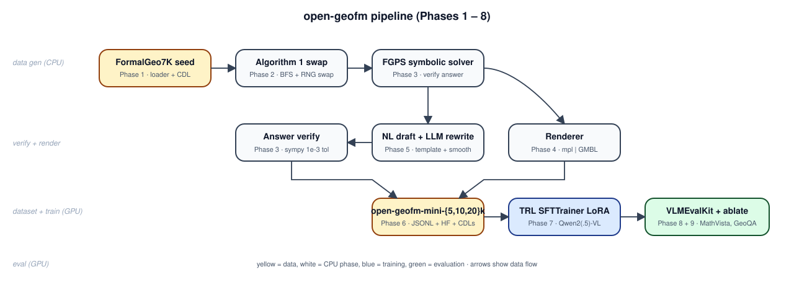
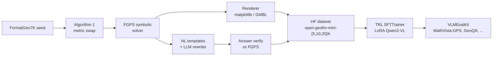

# open-geofm

[](LICENSE)
[](pyproject.toml)
[](https://arxiv.org/abs/2510.27448)

> **Educational reproduction — not the official code.**
> This repository is a single-GPU, LoRA-only re-implementation of the **data-generation methodology** described in *GeoFM* (Zhang et al., 2025, Tencent Hunyuan, arXiv:2510.27448). It is **not affiliated with the authors**, the original paper has no public code release, and we fine-tune **Qwen2-VL-2B/7B + Qwen2.5-VL-7B with LoRA** on a reduced **10–20K** dataset rather than the paper's 80K full-parameter SFT of LLaVA-NeXT-8B / InternVL2-8B-MPO on an H20 96 GB GPU. The goal is **pedagogical clarity**, not state-of-the-art performance.

---

## What this IS / IS NOT

| | open-geofm | original GeoFM |
|---|---|---|
| Base MLLM | Qwen2-VL-2B/7B, Qwen2.5-VL-7B | LLaVA-NeXT-8B, InternVL2-8B-MPO |
| Fine-tune method | LoRA (r=16, all-linear) | full-parameter SFT |
| Data scale | 5K / 10K / 20K | 80K |
| Compute | single RTX 5090 (32 GB) | NVIDIA H20 96 GB |
| Diagram renderer | matplotlib + GMBL-style re-impl | custom GMBL engine + mapping table |
| Realistic eval target | **+8–15 pp** over base on MathVista-GPS / GeoQA | +18.7 pp over GPT-4o on MathVista-GPS |

---

## Pipeline



(Same flow, as Mermaid:)



---

## Quickstart

```bash
# 1. Host venv for the CPU phases (FormalGeo, sampling, render, NLG templates).
uv sync --extra formal --extra nlg

# 2. Smoke test the CPU pipeline (no GPU).
uv run python scripts/00_verify_env.py --cpu-only
uv run pytest -q

# 3. Build the Blackwell training image (GPU phases).
docker compose -f docker/docker-compose.yml build

# 4. Verify GPU env from inside the container.
docker compose -f docker/docker-compose.yml run --rm train

# 5. Generate 100-sample smoke dataset, train, eval (full pipeline).
uv run python scripts/02_generate_dataset.py --n 100 --renderer matplotlib --out data/smoke
docker compose -f docker/docker-compose.yml run --rm train \
    bash scripts/03_train.sh qwen2vl_2b_lora --dataset data/smoke --max-steps 50
docker compose -f docker/docker-compose.yml run --rm train \
    bash scripts/04_eval.sh qwen2vl_2b_lora outputs/qwen2vl-2b-lora
```

Full ten-week phase plan + Blackwell pain-log: see the **[wiki](https://github.com/danghoangnhan/open-geofm/wiki)**.

---

## Hardware & software stack

* **GPU**: NVIDIA RTX 5090 (Blackwell, sm_120, 32 GB).
* **Driver**: 570+ (Linux) / 576+ (Windows).
* **CUDA toolkit**: 12.8 or 12.9 — *not* 12.0 (no sm_120 kernels).
* **Inside Docker** (NGC `pytorch:25.02-py3`):
  - PyTorch ≥ 2.7 cu128 wheels.
  - FlashAttention 2 from source. **FA4 cannot run on sm_120** (TMEM absent) — never try.
  - bitsandbytes from source. **QLoRA gated** behind `OPEN_GEOFM_ENABLE_QLORA=1` until bnb sm_120 stabilises.
  - vLLM ≥ 0.8.0 with `VLLM_FLASH_ATTN_VERSION=2`.
* **Package manager**: [astral uv](https://github.com/astral-sh/uv) — `uv sync` / `uv run` everywhere.

---

## Citation

If you use this implementation, please cite **both** the original GeoFM paper and this repository.

```bibtex
@article{zhang2025geofm,
  title  = {GeoFM: Geometry Foundation Model with Formal-Language Data Synthesis},
  author = {Zhang, et al.},
  journal= {arXiv:2510.27448},
  year   = {2025}
}

@software{open_geofm,
  title  = {open-geofm: An educational reproduction of GeoFM on a single RTX 5090},
  author = {open-geofm contributors},
  year   = {2026},
  url    = {https://github.com/danghoangnhan/open-geofm}
}
```

A Zenodo DOI is auto-minted on each tagged release via `CITATION.cff`.

---

## Acknowledgements

* **FormalGeo / FGPS** (BitSecret) — symbolic engine + the FormalGeo7K seed corpus.
* **Qwen team** (Alibaba) — Qwen2-VL and Qwen2.5-VL base models.
* **HuggingFace TRL + PEFT** — `SFTTrainer` and LoRA.
* **VLMEvalKit** (OpenCompass) — multimodal evaluation harness.
* **MAVIS / DFE-GPS / G-LLaVA / GeoX** — prior art that informed the design.
